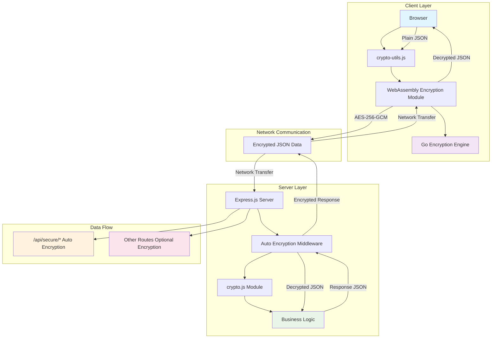

# 🔐 Web Security - Bidirectional Encryption Communication System

A secure web application built with complete JSON automatic encryption/decryption system

## 🔄 System Architecture



## 🚀 Quick Start

### Run with Docker Compose
```bash
# Build and run development environment
docker-compose up -d wasm-builder pnpm-dev && docker-compose up -d frontend backend

# Run production environment
docker-compose up -d frontend backend
```

### Individual Setup (Development)
```bash
# Install all dependencies
pnpm install:all

# Build WebAssembly module
pnpm build:wasm

# Run backend server (port 3000)
pnpm dev:backend

# Run frontend server (port 8000)
pnpm dev:frontend

# Run both simultaneously
pnpm dev
```

### Access in Web Browser
- **Main Demo**: http://localhost:8000
- **Security Demo**: http://localhost:8000/secure-demo.html

## ✨ Key Features

### 🔒 Automatic Encryption/Decryption
- **Fully Automated**: All JSON data is automatically encrypted/decrypted during server-client communication
- **Transparent Processing**: Developers can code as if working with plain JSON while all communication is encrypted
- **Middleware-Based**: Backend provides automatic encryption/decryption middleware

### 🛡️ Strong Security
- **AES-256-GCM**: Industry-standard encryption algorithm
- **WebAssembly**: High-performance encryption engine written in Go
- **Path-Based Security**: `/api/secure/` routes use automatic encryption, regular routes use optional encryption

### 🚀 Practical API
- **User Management**: Registration, login (encrypted)
- **Data Management**: CRUD operations (encrypted)
- **Message System**: Secure messaging (encrypted)
- **System Diagnostics**: Health check, encryption info retrieval

## Screenshots


## 🏗️ System Structure

```
📁 Project Root
├── 📁 backend/                    # Express.js Server
│   ├── 📁 src/
│   │   ├── 🔧 index.js           # Main server (with auto encryption middleware)
│   │   ├── 🔐 crypto.js          # Encryption module + JSON processing + middleware
│   │   └── 🧪 test.js            # Test script
│   ├── 📄 package.json
│   ├── 🐳 Dockerfile
│   └── 📖 README.md
├── 📁 frontend/                   # Client Application
│   ├── 📁 src/
│   │   ├── 🌐 index.html         # Main demo page
│   │   ├── 🔐 secure-demo.html   # New security demo page
│   │   ├── 🛠️ crypto-utils.js    # Client encryption utilities
│   │   └── 📁 crypto-wasm/       # WebAssembly Module
│   │       ├── 🔒 main.wasm      # Compiled WebAssembly binary
│   │       ├── ⚙️ wasm_exec.js   # WebAssembly executor
│   │       ├── 🔥 main.go        # Go encryption source code
│   │       ├── 🔨 build.sh       # Linux/macOS build script
│   │       └── 🔨 build.bat      # Windows build script
│   ├── 📄 package.json
│   ├── 🐳 Dockerfile
│   ├── 🔧 dev-server.js          # Development server
│   ├── ⚙️ nginx.conf             # Nginx configuration
│   └── 📖 README.md
├── 🐳 docker-compose.yml         # Docker Compose configuration
├── 📦 package.json               # Root package configuration (pnpm workspace)
├── 🔒 pnpm-workspace.yaml        # pnpm workspace configuration
├── 🧪 test-secure-api.js          # API test script
├── 🧪 test-wasm.js               # WebAssembly test script
└── 📄 README.md                  # Current documentation
```

## 🔐 Encryption Operation Principles

### 1. Automatic Encryption Flow
```
Client → [JSON Encryption] → Server → [Auto Decryption] → Business Logic
Client ← [Auto Encryption] ← Server ← [JSON Response] ← Business Logic
```

### 2. Path-Based Processing
- **`/api/secure/*`**: Automatic encryption/decryption applied
- **Other Routes**: Optional encryption (developer controlled)

### 3. Data Transformation Process
```javascript
// On client side
const data = { username: "test", password: "secret" };
// ↓ Auto encryption
const encrypted = "base64_encrypted_data...";

// On server side
// ↓ Auto decryption
const decrypted = { username: "test", password: "secret" };
// ↓ Business logic processing
const response = { status: "success", user: {...} };
// ↓ Auto encryption
const encryptedResponse = "base64_encrypted_response...";
```

## 🛡️ Secure API Endpoints

### User Management (Auto Encrypted)
```javascript
// User Registration
POST /api/secure/user/register
{
  "username": "testuser",
  "email": "test@example.com", 
  "password": "password123",
  "profile": { "name": "John Doe" }
}

// User Login
POST /api/secure/user/login
{
  "username": "testuser",
  "password": "password123"
}
```

### Data Management (Auto Encrypted)
```javascript
// Data Creation
POST /api/secure/data/create
{
  "type": "document",
  "content": { "title": "Important Document", "body": "Confidential content" },
  "metadata": { "classification": "confidential" }
}

// Data Retrieval
POST /api/secure/data/read
{
  "type": "document",
  "filters": { "classification": "confidential" }
}
```

### Message System (Auto Encrypted)
```javascript
// Send Message
POST /api/secure/message/send
{
  "recipient": "admin",
  "subject": "Urgent Report",
  "content": "Confidential message content",
  "priority": "high"
}
```

## 🧪 Testing

### Backend Testing
```bash
# Basic encryption test
pnpm test:crypto

# JSON encryption test  
pnpm test:backend

# Full test suite
pnpm test

# Direct test execution
node test-secure-api.js
node test-wasm.js
```

### Frontend Testing
Open `secure-demo.html` in web browser and:
1. **System Status** check (WebAssembly load, server connection)
2. **User Management** test (registration, login)
3. **Data Management** test (creation, retrieval)
4. **Message Sending** test
5. **JSON Encryption** direct test

## 🔧 Client Usage

### Using CryptoUtils
```javascript
// Auto-initialized
const cryptoUtils = window.cryptoUtils;

// Secure API call (auto encryption/decryption)
const result = await cryptoUtils.registerUser({
  username: "test",
  email: "test@example.com",
  password: "secret"
});

if (result.success) {
  console.log("Registration successful:", result.data);
  console.log("Encrypted:", result.encrypted);
}
```

### Direct JSON Encryption/Decryption
```javascript
// JSON encryption
const data = { message: "Hello World!", secret: "confidential" };
const encrypted = cryptoUtils.encryptJSON(data);

// JSON decryption
const decrypted = cryptoUtils.decryptJSON(encrypted.encryptedData);
console.log("Decrypted data:", decrypted.data);
```

## 📊 Security Features

### 🔐 Encryption Specifications
- **Algorithm**: AES-256-GCM
- **Key Size**: 256-bit (32 bytes)
- **IV Size**: 96-bit (12 bytes)
- **Tag Size**: 128-bit (16 bytes)
- **Encoding**: Base64

### 🛡️ Security Considerations
- **Key Management**: Encryption key management via environment variables
- **HTTPS Recommended**: HTTPS required in production
- **Key Rotation**: Regular encryption key rotation recommended
- **Logging**: Sensitive data excluded from logs

## 🚀 Production Deployment

### Environment Variables
```bash
# Backend environment variables
ENCRYPTION_KEY=your_32_character_secret_key_here
NODE_ENV=production
PORT=3000

# Frontend environment variables
API_BASE_URL=https://your-backend-domain.com
```

### Docker Deployment
```bash
# For restart
docker-compose down --volumes --remove-orphans && docker system prune -f && docker-compose up -d wasm-builder pnpm-dev && docker-compose up -d frontend backend

# Deploy full stack
docker-compose up -d frontend backend

# Deploy with development environment
docker-compose --profile dev --profile pnpm-dev up -d

# Deploy individual services
docker-compose up -d backend
docker-compose up -d frontend
```

## 🤝 Contributing

1. Fork this repository
2. Create a feature branch (`git checkout -b feature/amazing-feature`)
3. Commit your changes (`git commit -m 'Add amazing feature'`)
4. Push to the branch (`git push origin feature/amazing-feature`)
5. Create a Pull Request

## 📝 License

This project is distributed under the MIT License. See `LICENSE` file for more details.

## 🔍 Additional Information

### Performance Optimization
- High-speed encryption using WebAssembly
- Efficient processing with middleware-based approach
- Non-blocking UI with asynchronous processing

### Scalability
- Easy extension with modular structure
- Plugin-style middleware approach
- RESTful API design

### Debugging
- Detailed logging system
- Real-time encryption status monitoring
- Browser developer tools support

---

**🔐 Experience a secure web application where all data is automatically encrypted!**
