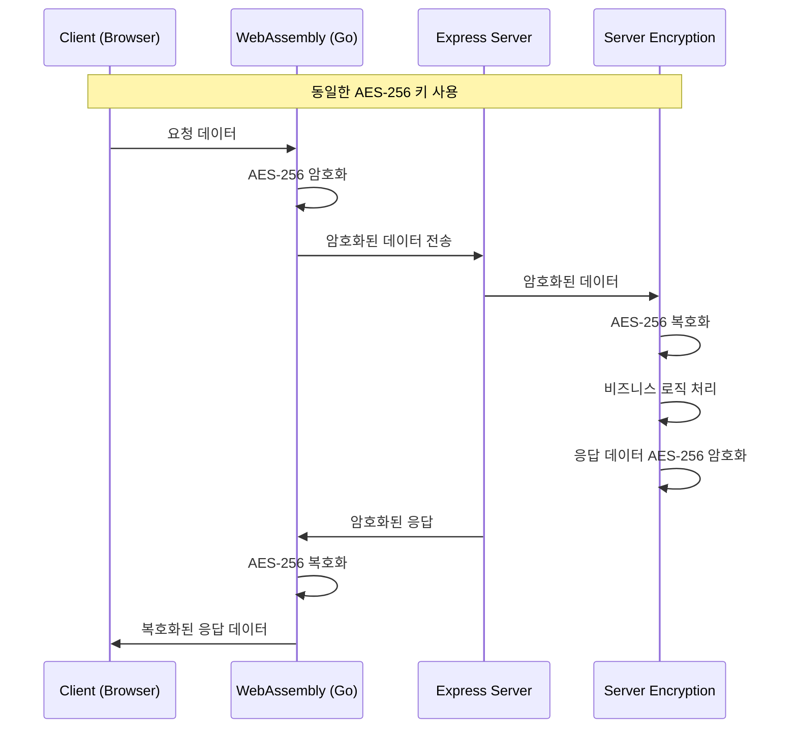

# Web Security - 양방향 암호화 통신 시스템 (pnpm)

이 프로젝트는 Node.js Express 서버와 클라이언트 간에 양방향 암호화를 통한 안전한 데이터 통신을 구현한 모노레포입니다. 
Go로 작성된 WebAssembly를 사용하여 클라이언트측 암호화/복호화를 처리하고, 서버에서도 동일한 키로 데이터를 암호화/복호화합니다.

**⚡ pnpm을 사용하여 빠르고 효율적인 패키지 관리를 제공합니다.**

## 🏗️ 프로젝트 구조

```
web-security/
├── frontend/          # 클라이언트 애플리케이션
│   ├── src/
│   ├── crypto-wasm/   # Go WebAssembly 암호화 모듈
│   └── package.json
├── backend/           # Express 서버
│   ├── src/
│   └── package.json
├── shared/            # 공유 설정 및 유틸리티
│   └── package.json
├── pnpm-workspace.yaml # pnpm 워크스페이스 설정
├── .npmrc             # pnpm 설정
└── README.md
```

## 🔐 암호화 시스템 아키텍처



## 🚀 빌드 및 실행 방법

### Prerequisites
- Node.js (v16 이상)
- pnpm (v8 이상) - `npm install -g pnpm`
- Go (v1.19 이상)

### 1. 전체 프로젝트 설정
```bash
# 루트 디렉토리에서
pnpm install
```

### 2. WebAssembly 빌드
```bash
pnpm build:wasm
```

### 3. 개발 서버 실행 (병렬)
```bash
pnpm dev
```
이 명령어는 백엔드(포트 3000)와 프론트엔드(포트 8000)를 동시에 실행합니다.

### 4. 개별 서버 실행
```bash
# 백엔드만 실행
pnpm dev:backend

# 프론트엔드만 실행
pnpm dev:frontend
```

## 📋 각 폴더별 빌드 방법

### Frontend (`/frontend`)
```bash
cd frontend
pnpm install          # 의존성 설치
pnpm build-wasm       # WebAssembly 빌드
pnpm dev              # 개발 서버 실행
pnpm build            # 프로덕션 빌드
```

### Backend (`/backend`)
```bash
cd backend
pnpm install          # 의존성 설치
pnpm dev              # 개발 서버 실행 (nodemon)
pnpm start            # 프로덕션 서버 실행
pnpm test             # 테스트 실행
pnpm test:crypto      # 암호화 테스트 실행
```

### WebAssembly Crypto Module (`/frontend/crypto-wasm`)
```bash
cd frontend/crypto-wasm
go mod tidy           # Go 모듈 정리
./build.sh            # WebAssembly 빌드 (Linux/Mac)
./build.bat           # WebAssembly 빌드 (Windows)
```

## 🔑 보안 특징

- **AES-256-GCM 암호화**: 강력한 대칭키 암호화 알고리즘 사용
- **동일 키 공유**: 클라이언트와 서버가 동일한 암호화 키 사용
- **WebAssembly**: 브라우저에서 네이티브 수준의 암호화 성능
- **실시간 암호화**: 모든 HTTP 요청/응답이 자동으로 암호화/복호화

## 🧪 테스트

```bash
# 전체 테스트
pnpm test

# 백엔드 암호화 테스트
pnpm test:crypto

# 개별 프로젝트 테스트
pnpm test:backend
pnpm test:frontend
```

## 📦 배포

### Docker 배포
```bash
# 프로덕션 빌드
pnpm build

# Docker Compose로 배포
docker-compose up --build

# pnpm 개발 환경 (Docker)
docker-compose --profile pnpm-dev up
```

### 수동 배포
```bash
# 프로덕션 빌드
pnpm build

# 프로덕션 서버 시작
pnpm start
```

## ⚡ pnpm의 장점

1. **빠른 설치**: 심볼릭 링크를 사용한 효율적인 패키지 관리
2. **디스크 공간 절약**: 중복 패키지 제거
3. **엄격한 의존성 관리**: 유령 의존성 방지
4. **모노레포 친화적**: 워크스페이스 기본 지원
5. **호환성**: npm과 yarn과 완전 호환

## 🛠️ 유용한 pnpm 명령어

```bash
# 모든 워크스페이스에 의존성 설치
pnpm install

# 특정 워크스페이스에서 명령 실행
pnpm --filter backend dev
pnpm --filter frontend build

# 모든 워크스페이스에서 병렬 실행
pnpm --parallel --recursive dev

# 의존성 정리
pnpm clean:deps

# 빌드 캐시 정리
pnpm store prune
```

## 🤝 기여하기

1. Fork the Project
2. Create your Feature Branch (`git checkout -b feature/AmazingFeature`)
3. Commit your Changes (`git commit -m 'Add some AmazingFeature'`)
4. Push to the Branch (`git push origin feature/AmazingFeature`)
5. Open a Pull Request
appLinks
## 📞 문의 및 지원

- 이슈 리포팅: GitHub Issues
- 문서: 각 폴더의 README.md 참조
- 라이선스: MIT