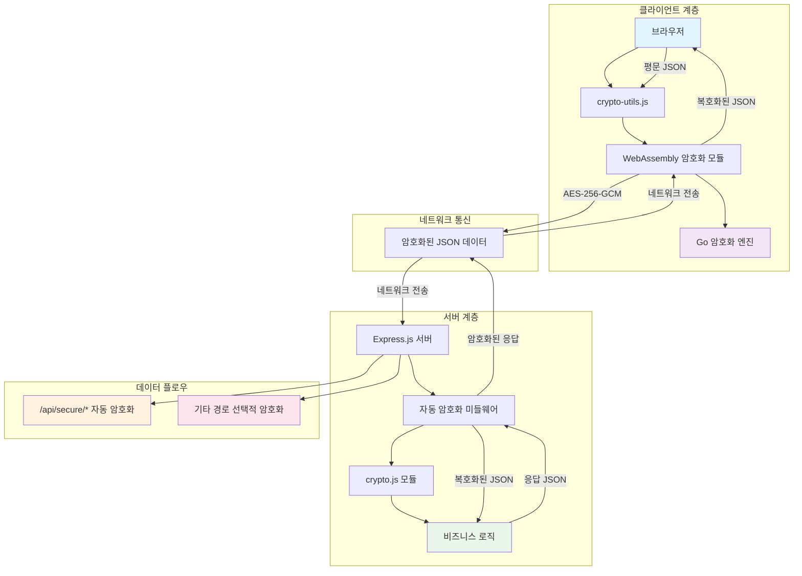
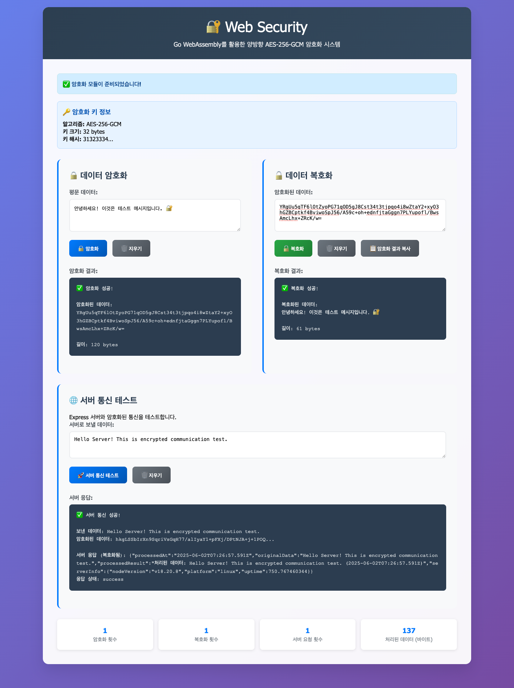

# 🔐 Web Security - 양방향 암호화 통신 시스템

완전한 JSON 자동 암호화/복호화 시스템으로 구축된 보안 웹 애플리케이션

## 🔄 시스템 동작 구조



## 🚀 빠른 실행

### Docker Compose로 전체 실행
```bash
# 개발환경 빌드 및 실행
docker-compose up -d wasm-builder pnpm-dev && docker-compose up -d frontend backend

# 프로덕션 환경 실행
docker-compose up -d frontend backend
```

### 개별 실행 (개발용)
```bash
# 전체 의존성 설치
pnpm install:all

# WebAssembly 모듈 빌드
pnpm build:wasm

# 백엔드 서버 실행 (포트 3000)
pnpm dev:backend

# 프론트엔드 서버 실행 (포트 8000)
pnpm dev:frontend

# 동시 실행
pnpm dev
```

### 웹 브라우저에서 확인
- **기본 데모**: http://localhost:8000
- **보안 데모**: http://localhost:8000/secure-demo.html

## ✨ 주요 기능

### 🔒 자동 암호화/복호화
- **완전 자동화**: 모든 JSON 데이터가 서버-클라이언트 간 전송 시 자동으로 암호화/복호화
- **투명한 처리**: 개발자는 평문 JSON을 다루듯 코딩하면서도 모든 통신이 암호화됨
- **미들웨어 기반**: 백엔드에서 자동 암호화/복호화 미들웨어 제공

### 🛡️ 강력한 보안
- **AES-256-GCM**: 업계 표준 암호화 알고리즘 사용
- **WebAssembly**: Go로 작성된 고성능 암호화 엔진
- **경로별 보안**: `/api/secure/` 경로는 자동 암호화, 일반 경로는 선택적 암호화

### 🚀 실용적인 API
- **사용자 관리**: 회원가입, 로그인 (암호화됨)
- **데이터 관리**: CRUD 작업 (암호화됨)
- **메시지 시스템**: 보안 메시징 (암호화됨)
- **시스템 진단**: 헬스체크, 암호화 정보 조회

## 실행 화면



## 🏗️ 시스템 구조

```
📁 프로젝트 루트
├── 📁 backend/                    # Express.js 서버
│   ├── 📁 src/
│   │   ├── 🔧 index.js           # 메인 서버 (자동 암호화 미들웨어 포함)
│   │   ├── 🔐 crypto.js          # 암호화 모듈 + JSON 처리 + 미들웨어
│   │   └── 🧪 test.js            # 테스트 스크립트
│   ├── 📄 package.json
│   ├── 🐳 Dockerfile
│   └── 📖 README.md
├── 📁 frontend/                   # 클라이언트 애플리케이션
│   ├── 📁 src/
│   │   ├── 🌐 index.html         # 기본 데모 페이지
│   │   ├── 🔐 secure-demo.html   # 새로운 보안 데모 페이지
│   │   ├── 🛠️ crypto-utils.js    # 클라이언트 암호화 유틸리티
│   │   └── 📁 crypto-wasm/       # WebAssembly 모듈
│   │       ├── 🔒 main.wasm      # 컴파일된 WebAssembly 바이너리
│   │       ├── ⚙️ wasm_exec.js   # WebAssembly 실행기
│   │       ├── 🔥 main.go        # Go 암호화 소스코드
│   │       ├── 🔨 build.sh       # Linux/macOS 빌드 스크립트
│   │       └── 🔨 build.bat      # Windows 빌드 스크립트
│   ├── 📄 package.json
│   ├── 🐳 Dockerfile
│   ├── 🔧 dev-server.js          # 개발 서버
│   ├── ⚙️ nginx.conf             # Nginx 설정
│   └── 📖 README.md
├── 📁 shared/                     # 공유 모듈
│   ├── 📋 constants.js           # 상수 및 설정
│   └── 📄 package.json
├── 🐳 docker-compose.yml         # Docker Compose 설정
├── 📦 package.json               # 루트 패키지 설정 (pnpm 워크스페이스)
├── 🔒 pnpm-workspace.yaml        # pnpm 워크스페이스 설정
├── 🧪 test-secure-api.js          # API 테스트 스크립트
├── 🧪 test-wasm.js               # WebAssembly 테스트 스크립트
└── 📄 README.md                  # 현재 문서
```

## 🔐 암호화 동작 원리

### 1. 자동 암호화 플로우
```
클라이언트 → [JSON 암호화] → 서버 → [자동 복호화] → 비즈니스 로직
클라이언트 ← [자동 암호화] ← 서버 ← [JSON 응답] ← 비즈니스 로직
```

### 2. 경로별 처리
- **`/api/secure/*`**: 자동 암호화/복호화 적용
- **기타 경로**: 선택적 암호화 (개발자 제어)

### 3. 데이터 변환 과정
```javascript
// 클라이언트에서
const data = { username: "test", password: "secret" };
// ↓ 자동 암호화
const encrypted = "base64_encrypted_data...";

// 서버에서
// ↓ 자동 복호화
const decrypted = { username: "test", password: "secret" };
// ↓ 비즈니스 로직 처리
const response = { status: "success", user: {...} };
// ↓ 자동 암호화
const encryptedResponse = "base64_encrypted_response...";
```

## 🛡️ 보안 API 엔드포인트

### 사용자 관리 (자동 암호화)
```javascript
// 회원가입
POST /api/secure/user/register
{
  "username": "testuser",
  "email": "test@example.com", 
  "password": "password123",
  "profile": { "name": "홍길동" }
}

// 로그인
POST /api/secure/user/login
{
  "username": "testuser",
  "password": "password123"
}
```

### 데이터 관리 (자동 암호화)
```javascript
// 데이터 생성
POST /api/secure/data/create
{
  "type": "document",
  "content": { "title": "중요 문서", "body": "기밀 내용" },
  "metadata": { "classification": "confidential" }
}

// 데이터 조회
POST /api/secure/data/read
{
  "type": "document",
  "filters": { "classification": "confidential" }
}
```

### 메시지 시스템 (자동 암호화)
```javascript
// 메시지 전송
POST /api/secure/message/send
{
  "recipient": "admin",
  "subject": "긴급 보고",
  "content": "기밀 메시지 내용",
  "priority": "high"
}
```

## 🧪 테스트

### 백엔드 테스트
```bash
# 기본 암호화 테스트
pnpm test:crypto

# JSON 암호화 테스트  
pnpm test:backend

# 전체 테스트 스위트
pnpm test

# 직접 테스트 실행
node test-secure-api.js
node test-wasm.js
```

### 프론트엔드 테스트
웹 브라우저에서 `secure-demo.html`을 열고:
1. **시스템 상태** 확인 (WebAssembly 로드, 서버 연결)
2. **사용자 관리** 테스트 (등록, 로그인)
3. **데이터 관리** 테스트 (생성, 조회)
4. **메시지 전송** 테스트
5. **JSON 암호화** 직접 테스트

## 🔧 클라이언트 사용법

### CryptoUtils 사용
```javascript
// 자동 초기화됨
const cryptoUtils = window.cryptoUtils;

// 보안 API 호출 (자동 암호화/복호화)
const result = await cryptoUtils.registerUser({
  username: "test",
  email: "test@example.com",
  password: "secret"
});

if (result.success) {
  console.log("등록 성공:", result.data);
  console.log("암호화됨:", result.encrypted);
}
```

### 직접 JSON 암호화/복호화
```javascript
// JSON 암호화
const data = { message: "Hello World!", secret: "confidential" };
const encrypted = cryptoUtils.encryptJSON(data);

// JSON 복호화
const decrypted = cryptoUtils.decryptJSON(encrypted.encryptedData);
console.log("복호화된 데이터:", decrypted.data);
```

## 📊 보안 특징

### 🔐 암호화 스펙
- **알고리즘**: AES-256-GCM
- **키 크기**: 256비트 (32바이트)
- **IV 크기**: 96비트 (12바이트)
- **태그 크기**: 128비트 (16바이트)
- **인코딩**: Base64

### 🛡️ 보안 고려사항
- **키 관리**: 환경변수로 암호화 키 관리 가능
- **HTTPS 권장**: 프로덕션에서는 HTTPS 필수
- **키 순환**: 정기적인 암호화 키 교체 권장
- **로깅**: 민감한 데이터는 로그에서 제외

## 🚀 프로덕션 배포

### 환경변수 설정
```bash
# 백엔드 환경변수
ENCRYPTION_KEY=your_32_character_secret_key_here
NODE_ENV=production
PORT=3000

# 프론트엔드 환경변수
API_BASE_URL=https://your-backend-domain.com
```

### Docker 배포
```bash
# 전체 스택 배포
docker-compose up -d frontend backend

# 개발 환경 포함 배포
docker-compose --profile dev --profile pnpm-dev up -d

# 개별 서비스 배포
docker-compose up -d backend
docker-compose up -d frontend
```

## 🤝 기여하기

1. 이 저장소를 Fork 합니다
2. 기능 브랜치를 생성합니다 (`git checkout -b feature/amazing-feature`)
3. 변경사항을 커밋합니다 (`git commit -m 'Add amazing feature'`)
4. 브랜치에 Push 합니다 (`git push origin feature/amazing-feature`)
5. Pull Request를 생성합니다

## 📝 라이선스

이 프로젝트는 MIT 라이선스 하에 배포됩니다. 자세한 내용은 `LICENSE` 파일을 참조하세요.

## 🔍 추가 정보

### 성능 최적화
- WebAssembly를 사용한 고속 암호화
- 미들웨어 기반 효율적인 처리
- 비동기 처리로 UI 블로킹 방지

### 확장성
- 모듈화된 구조로 쉬운 확장
- 플러그인 방식의 미들웨어
- RESTful API 설계

### 디버깅
- 상세한 로깅 시스템
- 실시간 암호화 상태 모니터링
- 브라우저 개발자 도구 지원

---

**🔐 모든 데이터가 자동으로 암호화되는 안전한 웹 애플리케이션을 경험해보세요!**